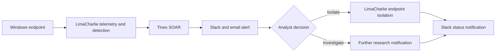

# SOAR Playbook Lab

A human-in-the-loop SOAR workflow that turns a LimaCharlie detection into analyst notifications and a controlled endpoint-isolation decision.

## Executive Summary

I built this lab to understand how a SOC playbook can automate repetitive work without removing analyst judgment. LimaCharlie monitored a Windows endpoint and sent a detection to Tines. Tines distributed the alert through Slack and email, asked the analyst whether the endpoint should be isolated, and followed the appropriate branch based on that decision.

The important design choice is the approval gate: containment occurs only after a human analyst selects it.

## Workflow

## Skills Demonstrated

- Onboarding a Windows endpoint to LimaCharlie
- Generating and reviewing security telemetry
- Building a branched Tines automation workflow
- Sending consistent Slack and email notifications
- Designing an analyst approval step before containment
- Translating an incident-response procedure into a repeatable playbook

## Technology

| Function | Tool |
| --- | --- |
| Endpoint monitoring and response | LimaCharlie |
| Security orchestration | Tines |
| Analyst communication | Slack and email |
| Lab infrastructure | Windows VM on Vultr |

## Full Walkthrough

1. [Part 1 — infrastructure, firewall, and LimaCharlie sensor](https://medium.com/@uju.woo243/creating-a-playbook-with-soar-step-by-step-guide-part-1-0443a0b11a12)
2. [Part 2 — telemetry and detection logic](https://medium.com/@uju.woo243/creating-a-playbook-with-soar-step-by-step-guide-part-2-37a3f1ad5615)
3. [Part 3 — Tines workflow, notifications, and isolation decision](https://medium.com/@uju.woo243/creating-a-playbook-with-soar-step-by-step-guide-part-3-d517f7b975fa)

## Next Iteration

I am refreshing this repository with a sanitized playbook export, sample detection data, MITRE ATT&CK mapping, failure-handling notes, and a short incident-response runbook.

> This workflow was built in a controlled lab. The isolation action is intentionally gated by an analyst decision.

